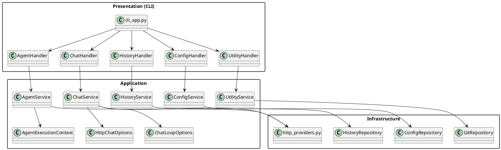

# Termi Architecture Diagrams

This document gives a visual overview of the internal architecture of Termi.

## 1. High-level layers

```text
+-----------------------------+
|         CLI / Handlers      |
|   (__main__, cli_app.py,    |
|   chat_handler, ... )       |
+--------------+--------------+
               |
               v
+-----------------------------+
|     Application Services    |
|  ChatService, AgentService, |
|  HistoryService,            |
|  ConfigService,             |
|  UtilityService, DTOs,      |
|  Service Container          |
+--------------+--------------+
               |
               v
+-----------------------------+
|        Infrastructure       |
|  http_providers,           |
|  ConfigRepository,         |
|  HistoryRepository,        |
|  GitRepository, memory.py  |
+-----------------------------+
```

- CLI/Handlers layer is responsible for parsing arguments, routing commands, and printing to the terminal.
- Application layer contains the business logic, orchestrated via services and small DTOs.
- Infrastructure layer encapsulates IO details (files, HTTP APIs, git, long‑term memory).

## 2. Services and handlers (PlantUML)



Use this diagram together with the short architecture summary in `README.md` for a complete picture of Termi's internal design.
